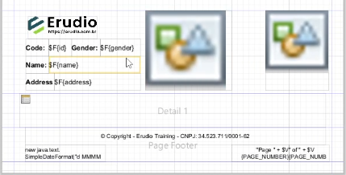
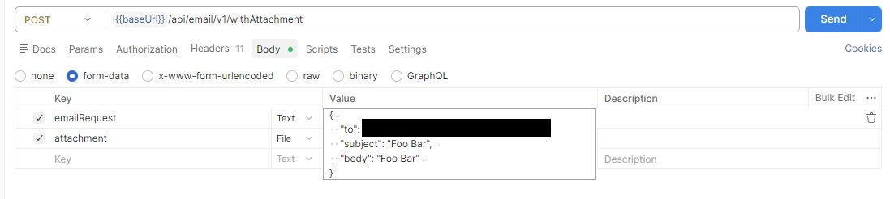
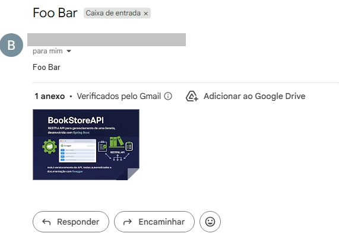
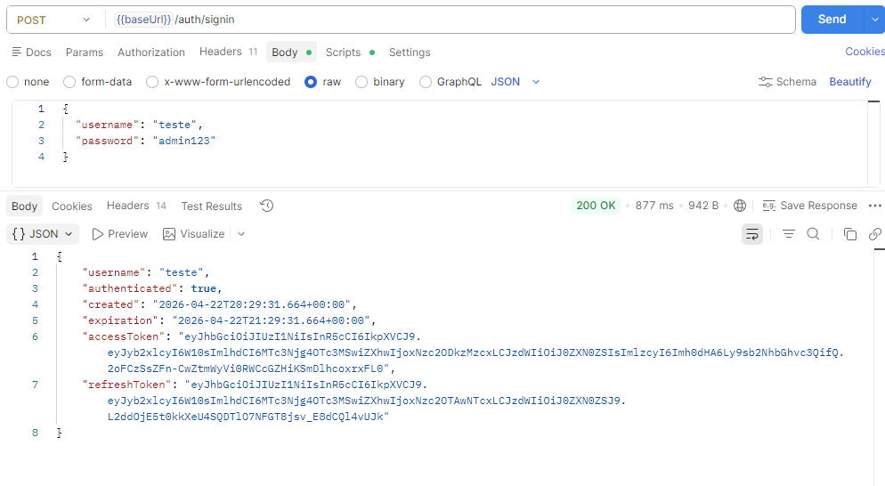
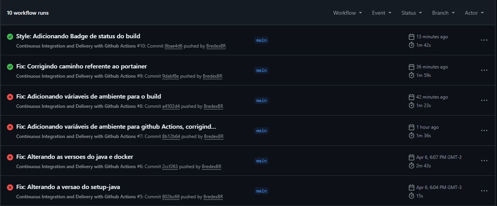

# 📚 Bookstore API

[](https://github.com/BredexBR/bookstore-api/actions/workflows/continuous-deployment.yml)

RESTful API para gerenciamento de uma livraria, desenvolvida com Spring Boot.
O projeto implementa boas práticas de desenvolvimento backend seguindo os princípios do **Glory of REST**, incluindo versionamento de API, testes automatizados e documentação com Swagger.

A API permite o gerenciamento completo de livros, incluindo operações de criação, consulta, atualização e remoção.

---

## Índice

- [Person](#person)
- [Book](#book)
- [Logs no Spring Boot](#logs-no-spring-boot)
- [Padrão DTO com Dozer Mapper](#padrão-dto-com-dozer-mapper)
- [Migrações com Flyway](#migrações-com-flyway)
- [Content Negotiation](#content-negotiation)
- [HATEOAS](#hateoas)
- [Testes unitários](#testes-unitários)
- [Testes de Integração](#testes-de-integração)
- [Documentação com Swagger (SpringDoc OpenAPI)](#documentação-com-swagger-springdoc-openapi)
- [CORS](#cors)
- [Query Params e Busca Paginada](#query-params-e-busca-paginada)
- [Upload e Download de Arquivos](#upload-e-download-de-arquivos)
- [Importação e Exportação de Planilhas Excel e CSV](#importação-e-exportação-de-planilhas-excel-e-csv)
- [Jaspersoft Ireport](#jaspersoft-ireport)
- [Spring Mail](#spring-mail)
- [JWT e Spring Security](#jwt-e-spring-security)
- [Docker](#docker)
- [CI/CD com GitHub Actions](#cicd-com-github-actions)
- [React]
- [O que é um Mock?](#o-que-é-um-mock)
- [Spring Boot Initializr](#spring-boot-initializr)
- [Geração de Mocks com Mockaroo](#geração-de-mocks-com-mockaroo)
- [Dependências utilizadas](#dependências-utilizadas)
- [Pré-requisitos](#pré-requisitos)

## Person

Este projeto implementa serviços HTTP (`POST`, `GET`, `DELETE` e `PUT`) utilizando Java com Spring Boot. Inicialmente, os dados eram simulados com [mocks](#o-que-é-um-mock), mas o projeto foi evoluído para realizar operações reais de CRUD utilizando um banco de dados MySQL com JPA (Java Persistence API).

### FindByID

Retorna uma pessoa de acordo com o seu ID:

<br>


### FindAll

Retorna todas as pessoas presentes:

<br>


### Create

Cria uma pessoa:

<br>


### Update

Atualiza os dados de uma pessoa:

<br>


### Delete

Deleta os dados de uma pessoa:

<br>


## Book

Este projeto também implementa serviços HTTP (`POST`, `GET`, `DELETE` e `PUT`) para a entidade **Book**, utilizando Java com Spring Boot. Assim como na entidade [Person](#person), realiza CRUD com um banco de dados MySQL utilizando JPA (Java Persistence API).

## Logs no Spring Boot

O projeto também utiliza logs para registrar o comportamento da aplicação durante a execução, facilitando o processo de depuração e monitoramento.

Para isso, foi utilizada a biblioteca **SLF4J** (Simple Logging Facade for Java), que fornece uma interface para diversas implementações de logging.

### Níveis de log disponíveis:

- `TRACE` – nível mais detalhado, geralmente usado para rastreamento fino
- `DEBUG` – informações úteis para desenvolvedores durante a depuração
- `INFO` – mensagens informativas sobre o fluxo normal da aplicação
- `WARN` – indica situações de alerta que não interrompem o sistema
- `ERROR` – indica falhas ou erros que exigem atenção

> Os logs ajudam a manter o controle do que está acontecendo na aplicação sem a necessidade de usar `System.out.println()`.

## Padrão DTO com Dozer Mapper

O projeto também adota o padrão **DTO (Data Transfer Object)** para separar a camada de apresentação dos modelos de entidade. Isso promove maior segurança, controle e clareza na exposição de dados via API.

Para realizar a conversão entre entidades e DTOs, foi utilizada a biblioteca **Dozer Mapper**, que simplifica o mapeamento automático entre objetos com estruturas semelhantes.

### Vantagens do uso de DTOs:

- Evita exposição direta de entidades JPA

- Facilita a criação de respostas customizadas

- Permite maior controle sobre os dados trafegados na API

- Ajuda na validação de entrada e saída de dados

> 📌 À medida que novos endpoints forem adicionados, novos DTOs serão criados para representar os dados da forma mais adequada para cada caso de uso.

## Migrações com Flyway

Este projeto utiliza a ferramenta **Flyway** para controle de versionamento e execução automática de migrações no banco de dados. Assim, garantimos que o esquema do banco esteja sempre sincronizado com o estado esperado da aplicação, independentemente do ambiente em que estiver rodando.

### O que é o Flyway?

O Flyway é uma biblioteca de versionamento de banco de dados que executa scripts SQL em sequência, com base em um esquema de versionamento (`V1__`, `V2__`, etc.). Ele mantém um histórico das migrações já aplicadas, evitando que scripts sejam executados mais de uma vez e facilitando o gerenciamento das mudanças no banco.

### Estrutura dos arquivos de migração

Os scripts SQL ficam localizados em:  
`src/main/resources/db/migration`

Cada arquivo de migração deve seguir a seguinte convenção de nomenclatura:  
`V<versão>__<descrição>.sql`

### Exemplo de arquivo de migração

```sql
V1__create_table_person.sql
```

### Benefícios de usar Flyway:

- Evita conflitos e inconsistências no banco entre ambientes
- Controla a ordem das alterações no esquema
- Permite reverter o estado do banco em ambientes de teste
- Mantém um histórico confiável das alterações aplicadas

> 📌 À medida que o projeto evolui, novas migrações serão adicionadas para refletir alterações nas entidades ou regras de negócio.

<br>


## Content Negotiation

Este projeto implementa **Content Negotiation**, permitindo que as requisições HTTP aceitem e retornem dados em múltiplos formatos, como:

- `application/json`
- `application/xml`
- `application/x-yaml`

Com isso, o cliente pode escolher o formato de resposta desejado utilizando o cabeçalho `Accept`.

### Vantagens

- Flexibilidade para integrar com diferentes tipos de clientes

- Melhora a interoperabilidade da API

- Facilita testes e desenvolvimento com ferramentas como Postman, Insomnia e cURL

> 📌 A configuração de Content Negotiation foi feita com base no uso do WebMvcConfigurer no Spring Boot, definindo os MediaType suportados e suas extensões correspondentes.

<br>


## HATEOAS

Este projeto implementa **HATEOAS (Hypermedia as the Engine of Application State)** para enriquecer as respostas da API com links de navegação relacionados às ações possíveis no recurso.

Cada resposta dos endpoints inclui referências para outras operações relevantes, como:

- **Create** – Criação de novos recursos
- **FindById** – Consulta de recurso específico
- **FindAll** – Listagem de todos os recursos
- **Update** – Atualização de dados
- **Delete** – Remoção de recurso

Isso facilita a navegação e a compreensão da API por parte do consumidor, promovendo um design mais RESTful.

<br>


## Testes unitários

Os testes unitários deste projeto são escritos utilizando **JUnit 5** em conjunto com o **Mockito**, garantindo a qualidade e a confiabilidade das funcionalidades da API.

As principais operações da API (Create, FindById, FindAll, Update e Delete) são testadas de forma isolada, com simulação de dependências externas através do Mockito.

### Benefícios:

- Validação automática do comportamento esperado da aplicação
- Redução de bugs e regressões em alterações futuras
- Facilidade de manutenção do código
- Maior confiança em deploys e integrações contínuas

Os testes estão localizados no diretório:  
`Bookstore-api\src\test\java\br\com\erudio`

> 📌 À medida que novas funcionalidades forem implementadas, novos testes unitários serão adicionados para cobrir os cenários correspondentes.

<br>


## Testes de Integração

Para garantir que os endpoints da API estejam funcionando corretamente em conjunto com o ambiente real de execução, o projeto utiliza testes de integração com as bibliotecas **[Testcontainers](https://www.testcontainers.org/)** e **[Rest Assured](https://rest-assured.io/)**.

### Testcontainers

Com o Testcontainers, é possível criar e gerenciar containers Docker diretamente nos testes automatizados, garantindo um ambiente isolado e consistente. Neste projeto, é utilizado um container MySQL, configurado dinamicamente durante os testes.

#### Vantagens do uso do Testcontainers:

- Evita dependência de banco de dados local ou ambiente externo
- Garante um ambiente de testes consistente para todos os desenvolvedores
- Possibilita integração contínua com testes reais de banco de dados
- Os dados são descartados ao final dos testes, mantendo o ambiente limpo

> 📌 A configuração do Testcontainers está localizada nos arquivos de teste da entidade `Person`.

### Rest Assured

A biblioteca **Rest Assured** é utilizada para simular e validar chamadas HTTP diretamente nos testes, permitindo verificar o comportamento dos endpoints da API em nível de integração.

#### Com o Rest Assured é possível:

- Enviar requisições HTTP `GET`, `POST`, `PUT`, `DELETE` de forma fluente
- Validar os códigos de resposta (200, 201, 404, etc.)
- Testar os payloads de entrada e saída com facilidade
- Verificar headers, corpo da resposta e tempo de resposta

#### Exemplo de fluxo testado:

1. **Criar** uma pessoa com `POST /api/person/v1`
2. **Consultar** com `GET /api/person/v1/{id}`
3. **Atualizar** com `PUT /api/person/v1`
4. **Excluir** com `DELETE /api/person/v1/{id}`

Esses testes verificam desde a persistência no banco até o retorno correto dos dados via HTTP.

### Benefícios dos testes de integração:

- Validação de ponta a ponta da aplicação (API + Banco)
- Redução de erros em produção
- Simulação de ambiente real
- Confiança na cobertura dos principais fluxos de negócio

## Documentação com Swagger (SpringDoc OpenAPI)

Este projeto utiliza a biblioteca [SpringDoc OpenAPI](https://springdoc.org/#google_vignette) para gerar automaticamente a documentação interativa da API no padrão Swagger.
<br>

Para se aprofundar mais acessar o [link](https://lankydan.dev/documenting-a-spring-rest-api-following-the-openapi-specification).
<br>


## CORS

Este projeto implementa a configuração de **CORS (Compartilhamento de Recursos entre Origens Diferentes)** para permitir que aplicações frontend (como React, Angular, etc.) possam se comunicar com a API mesmo estando hospedadas em domínios diferentes.

### O que é CORS?

CORS(Cross-Origin Resource Sharing) é um mecanismo de segurança dos navegadores que impede requisições entre diferentes origens (domínios) caso não estejam explicitamente autorizadas. Sem essa configuração, ao tentar consumir a API de um frontend hospedado em outra origem, o navegador bloquearia a requisição.

### Exemplo de problema comum:

Uma aplicação frontend hospedada em `http://localhost:3000` tenta acessar a API em `http://localhost:8080`, resultando em erro de CORS caso não esteja permitido.

### Solução adotada no projeto

A configuração de CORS foi feita para liberar origens específicas ou de forma global, permitindo que aplicações externas possam consumir os endpoints da API sem bloqueios.

### Vantagens de configurar o CORS corretamente:

- Permite integração com aplicações frontend modernas

- Evita erros de bloqueio em navegadores

- Garante segurança controlando quem pode acessar a API

> 📌 Em ambientes de produção, é recomendado limitar as origens permitidas apenas aos domínios necessários.

## Query Params e Busca Paginada

Este projeto também implementa **busca paginada** utilizando query parameters, o que permite controlar a forma como os dados são retornados pela API, especialmente em grandes volumes.

A busca paginada é útil para:

- Melhorar a performance das requisições
- Evitar sobrecarregar o cliente com muitos dados de uma vez
- Facilitar a navegação por grandes listas de recursos

#### Parâmetros aceitos:

- `page`: número da página (começando em 0)
- `size`: quantidade de registros por página
- `direction`: direção da ordenação (`asc` para crescente, `desc` para decrescente)

### HAL (Hypertext Application Language)

As respostas da API seguem o padrão **HAL (Hypertext Application Language)**, um formato que adiciona hiperlinks aos dados retornados, facilitando a navegação entre recursos relacionados.

Isso significa que cada item retornado na busca paginada inclui _links_ como:

- `self`: link para o próprio recurso
- `first`, `prev`, `next`, `last`: links de paginação
- Ações adicionais, como `update` ou `delete`

### Exemplo visual da resposta:

<br>


> 📌 O uso de HAL facilita a criação de clientes mais inteligentes e alinhados com os princípios RESTful, promovendo a auto-descoberta dos recursos da API.

## Upload e Download de Arquivos

O projeto também implementa funcionalidades de **upload e download de arquivos**, permitindo que clientes da API enviem e recuperem arquivos diretamente do servidor.

### Upload de Arquivo

A API aceita arquivos enviados por meio de uma requisição `POST` com `multipart/form-data`.


### Download de Arquivo

Para baixar um arquivo já armazenado no servidor, basta fazer uma requisição `GET` ao endpoint correspondente, informando o nome do arquivo.


### Vantagens

- Facilita o envio de imagens, documentos e outros arquivos como parte de um fluxo de negócio
- Permite integrar com sistemas externos ou frontends que trabalham com arquivos
- Simples de consumir com ferramentas como Postman ou aplicações frontend

> 📌 Os arquivos são armazenados em uma pasta específica do servidor e podem ser protegidos conforme as necessidades do projeto.

## Importação e Exportação de Planilhas Excel e CSV

O projeto também implementa funcionalidades de **importação e exportação
de dados** nos formatos **Excel (.xlsx)** e **CSV**, permitindo uma
integração eficiente com sistemas externos, ferramentas de análise e
planilhas manipuladas por usuários finais.

Esses recursos são essenciais em aplicações que precisam lidar com
grandes volumes de dados, realizar migrações, importar cadastros ou
fornecer relatórios.

### 📥 Importação (Upload)

A API permite enviar arquivos Excel ou CSV para realizar a leitura e
processamento dos dados.
Durante a importação, o sistema:

- Valida o formato do arquivo enviado
- Converte os dados para objetos da aplicação
- Realiza o processamento necessário (cadastro, atualização ou
  análise)
- Retorna feedback sobre possíveis erros ou inconsistências

Esse processo é realizado através de um endpoint `POST`.

> 📌 A importação é útil para cadastrar listas de pessoas.


---

### 📤 Exportação (Download)

A API também oferece endpoints para **exportar dados em formato Excel ou
CSV**.
Ao realizar a exportação, o sistema:

- Consulta os dados diretamente no banco
- Gera dinamicamente a planilha ou arquivo CSV
- Retorna o arquivo pronto para download

Essa funcionalidade é ideal para relatórios, backups ou migração de
dados para outros sistemas.


## 

### Vantagens

- Facilita integração com sistemas externos
- Permite criação de relatórios personalizados
- Agiliza cadastros em massa
- Possibilita backup dos dados da aplicação
- Simples de consumir usando Postman, Insomnia ou frontends como React
  e Angular

## Jaspersoft Ireport

O projeto também implementa a geração de **relatórios profissionais em PDF**, permitindo visualizar de forma organizada os livros cadastrados por um usuário.

### 📄 Geração de Relatório em PDF

A API consulta os dados diretamente no banco de dados e gera automaticamente um relatório estruturado contendo as informações dos livros.

Esse processo é realizado utilizando:

- **JasperReports (Jaspersoft iReport)** para criação e formatação do relatório
- Templates `.jrxml` para definição do layout do documento

### 🔎 O que o relatório contém:

- Dados dos livros cadastrados
- Informações organizadas em formato tabular
- Layout profissional pronto para impressão ou compartilhamento

### ⚙️ Como funciona:

1. O cliente realiza uma requisição para o endpoint de relatório
2. A API consulta os dados no banco (MySQL)
3. Os dados são enviados para o template do JasperReports
4. O PDF é gerado dinamicamente
5. O arquivo é retornado para download

### 📥 Exemplo visual do relatório:

<br>




### 🚀 Vantagens

- Geração automática de documentos profissionais
- Facilidade para exportar e compartilhar dados
- Ideal para relatórios gerenciais
- Integração simples com o backend existente

> 📌 Essa funcionalidade é especialmente útil para fornecer uma visão consolidada dos dados de forma elegante e pronta para uso em ambientes corporativos.

## Spring Mail

A funcionalidade de e-mail foi desenvolvida como um componente desacoplado, permitindo reutilização em diferentes partes do sistema.

### ⚙️ Funcionalidades implementadas:

- Configuração SMTP externa via `application.yml`
- Suporte ao envio de e-mails com anexos
- Uso do **Builder Pattern** para facilitar a construção das mensagens

## 📥 Exemplo visual:

<br>








### 🧩 Arquitetura e boas práticas

A implementação foi pensada para seguir princípios de boas práticas de desenvolvimento:

- Separação de responsabilidades
- Baixo acoplamento entre componentes
- Facilidade de manutenção e extensão
- Código limpo e organizado

💡 A ideia foi transformar o envio de e-mails em um módulo reutilizável dentro da aplicação, evitando duplicação de lógica e facilitando futuras evoluções.

### 🔁 Casos de uso

Esse componente pode ser reutilizado em diversas funcionalidades, como:

- Notificações do sistema
- Confirmação de cadastro
- Recuperação de senha
- Envio de documentos

### 🚀 Vantagens

- Reutilização de código em múltiplos contextos
- Facilidade de configuração e adaptação
- Suporte a diferentes tipos de envio (simples e com anexos)
- Melhor organização da camada de serviços

> 📌 Essa abordagem torna o sistema mais escalável e preparado para crescer, mantendo a consistência na forma como os e-mails são enviados.

## JWT e Spring Security

O projeto implementa uma camada essencial de **segurança** utilizando **JWT (JSON Web Token)** em conjunto com o **Spring Security**, garantindo proteção dos endpoints da API.

Agora, operações como:

- Criar pessoa
- Encontrar pessoa por ID
- Listar todas as pessoas cadastradas
- Criar livro

exigem autenticação válida via token JWT.

### 🔐 Como funciona?

O fluxo de autenticação foi projetado seguindo boas práticas de APIs RESTful:

1. O usuário realiza login informando suas credenciais
2. A API gera um **access token (JWT)** com validade de **1 hora**
3. Também é fornecido um **refresh token**, com validade de **3 horas**
4. Quando o token expira, é possível gerar um novo access token utilizando o refresh token
5. Todas as requisições protegidas exigem o envio do token no header `Authorization`

## 📥 Exemplo visual:
<br>


### 🧩 Características da implementação

- Autenticação baseada em token (stateless)
- Proteção de endpoints sensíveis
- Separação clara entre autenticação e regras de negócio
- Estrutura preparada para escalabilidade

### 🚀 Por que isso é importante?

A implementação de JWT com Spring Security traz diversos benefícios:

- APIs **stateless** (sem necessidade de sessão no servidor)
- Maior segurança nas requisições
- Controle refinado de acesso aos recursos
- Redução de vulnerabilidades comuns
- Base sólida para aplicações reais em produção

> 📌 Essa abordagem é amplamente utilizada no mercado e representa um passo importante na construção de APIs seguras, escaláveis e prontas para ambientes produtivos.

## Docker

O projeto foi containerizado utilizando **Docker**, permitindo que a aplicação e seus serviços sejam executados de forma padronizada e independente do ambiente local.

### ⚙️ Orquestração com Docker Compose

O ambiente da aplicação é composto por múltiplos serviços que trabalham em conjunto, incluindo:

- Banco de dados MySQL
- API Bookstore
- Portainer (interface de gerenciamento de containers)

### 🧩 Como funciona

- O **MySQL** é executado em um container isolado
- A **API** se conecta ao banco de dados através de uma rede interna
- Os serviços se comunicam de forma segura dentro de uma network dedicada
- O **Portainer** permite gerenciar os containers via interface web
- Variáveis sensíveis são configuradas externamente (ex: `.env`)

### 🚀 Vantagens

- Ambiente totalmente isolado e padronizado
- Facilidade para subir o projeto com um único comando (`docker-compose up`)
- Elimina problemas de configuração local
- Pronto para deploy em qualquer ambiente
- Escalabilidade facilitada
- Melhor organização dos serviços da aplicação

### 📌 Observações

- A aplicação está preparada para rodar em containers de forma independente
- As configurações permitem fácil integração com serviços externos
- O uso de Docker facilita testes, integração contínua e deploy

> 💡 O uso do Docker torna o projeto mais profissional, garantindo consistência entre ambientes de desenvolvimento, teste e produção.

## CI/CD com GitHub Actions

**CI/CD (Integração Contínua e Entrega Contínua)** com **GitHub Actions**, automatizando o processo de build, criação de imagens Docker e publicação no Docker Hub.

### 🔄 Integração Contínua (CI)

Sempre que há um `push` na branch `main`, o pipeline é executado automaticamente, realizando:

- Checkout do código-fonte
- Configuração do ambiente com **Java 21**
- Build da aplicação utilizando Maven
- Empacotamento do projeto em um arquivo `.jar`

### 🚀 Entrega Contínua (CD)

Após o build da aplicação:

- A imagem Docker da API é gerada automaticamente
- A imagem é versionada utilizando o identificador do workflow (`run_id`)
- A imagem é enviada para o **Docker Hub**

### 🔐 Segurança

- Credenciais sensíveis (como Docker Hub e banco de dados) são armazenadas utilizando **GitHub Secrets**
- Nenhuma informação sensível é exposta no código

## 📥 Exemplo visual:
<br>



### 🧩 Benefícios da automação

- Redução de erros manuais no processo de build e deploy
- Entregas mais rápidas e consistentes
- Facilidade para escalar o projeto
- Integração com pipelines modernos de desenvolvimento

### 📌 Fluxo resumido

1. Desenvolvedor realiza um `push` na branch `main`
2. O GitHub Actions inicia o pipeline automaticamente
3. A aplicação é compilada e empacotada
4. A imagem Docker é construída e versionada
5. A imagem é publicada no Docker Hub

> 💡 Essa abordagem garante um fluxo automatizado e confiável, aproximando o projeto de práticas utilizadas em ambientes profissionais e pipelines de produção.

## O que é um Mock?

Um _mock_ é uma simulação de um objeto real. Em contextos de desenvolvimento e testes, mocks são usados para representar dados ou comportamentos esperados de componentes que ainda não foram implementados, ou que não se deseja acessar diretamente (como chamadas a APIs externas ou bancos de dados).

No contexto deste projeto, o _mock_ de pessoa é uma classe ou objeto com atributos pré-definidos (como nome, idade, CPF, etc.) que representa uma instância de `Person`. Ele é utilizado para simular uma requisição HTTP de criação de pessoa, facilitando o desenvolvimento e os testes do serviço sem depender de entradas externas.

## Spring Boot Initializr

Para gerar um novo projeto Spring Boot, acesse o [Spring Initializr](https://start.spring.io/).

## Geração de Mocks com Mockaroo

Durante o desenvolvimento do projeto, foi utilizado o site [Mockaroo](https://mockaroo.com/) para gerar dados falsos (mocks) de forma rápida, prática e personalizável.

### O que é o Mockaroo?

O **Mockaroo** é uma ferramenta online que permite gerar conjuntos de dados fictícios com campos customizados, tipos variados e formatos exportáveis (como CSV, JSON, SQL etc.).

### Vantagens de usar Mockaroo:

- Economia de tempo na criação de dados para testes
- Customização de nomes de campos, formatos e quantidades
- Simulação realista de dados como nomes, endereços, datas, números, etc.
- Suporte a exportação em diversos formatos compatíveis com APIs e bancos de dados

> 📌 O uso do Mockaroo acelerou significativamente a geração de massa de dados para testes de endpoints e visualização de resultados, substituindo a criação manual de objetos mock.

## Dependências utilizadas

[pom.xml](https://github.com/BredexBR/bookstore-api/blob/main/bookstore-api/pom.xml)

## Pré-requisitos

1. **Java 21**: Certifique-se de que o Java 21 está instalado na sua máquina.
2. **Docker**: Necessário para a execução de containers. Versão 27.4.0.
3. **MySQL**: Configuração do banco de dados. Versão 8.0.40.
4. **Postman**: Para testar a API.
5. **Java Spring Tool**: Framework na versão 3.3.7.
6. **Mvn**: Gerenciar as dependências e automatizar as builds. Versão 3.3.9.
