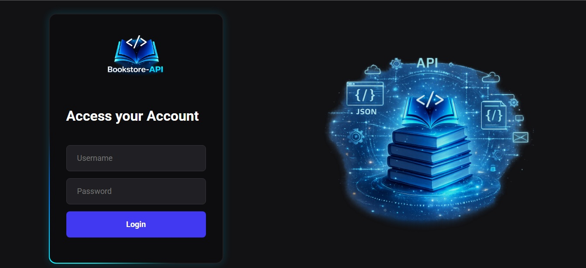
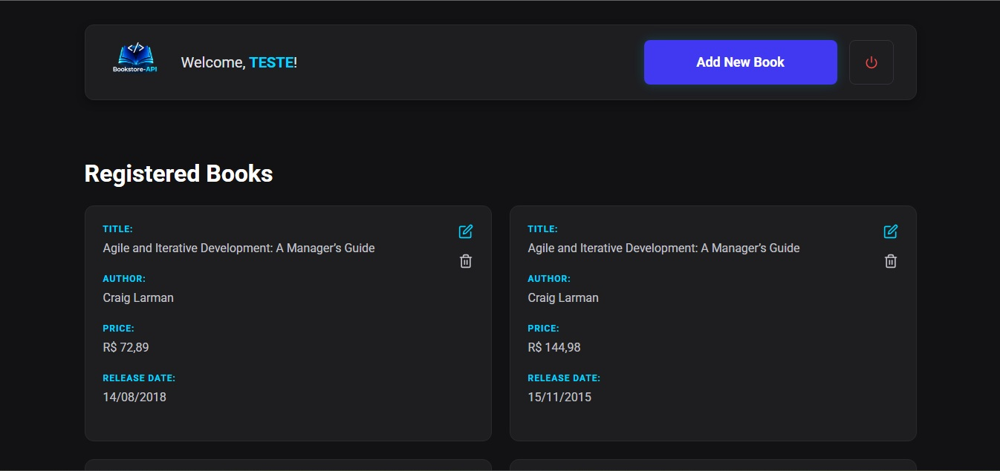

# ⚛️ Bookstore Client (React)

Interface web moderna desenvolvida com **React** e **Vite.js** para consumir a [Bookstore API](https://github.com/BredexBR/bookstore-api). 
O projeto foi construído focando em uma experiência de usuário fluida, utilizando componentes funcionais, hooks modernos e integração segura com a camada de segurança Spring Security (JWT).

---

## 📌 Índice

- [Tecnologias](#-tecnologias)
- [Funcionalidades](#-funcionalidades)
- [Estrutura do Projeto](#-estrutura-do-projeto)
- [Autenticação JWT](#-autenticação-jwt)
- [Paginação e Load More](#-paginação-e-load-more)
- [Exemplo Visual](#-exemplo-visual)

---

## 🚀 Tecnologias

As principais ferramentas utilizadas no desenvolvimento do frontend:

- **React 18**: Biblioteca principal para construção da UI.
- **Vite.js**: Ferramenta de build ultra-rápida e moderna.
- **React Router Dom**: Gerenciamento de rotas e navegação SPA.
- **Axios**: Cliente HTTP para consumo da API REST.
- **React Icons**: Conjunto de ícones para interface (Feather Icons).
- **Intl (Internationalization)**: Formatação nativa de moedas (BRL) e datas.

---

## ✨ Funcionalidades

### 🔐 Login & Segurança
O acesso à plataforma é restrito. O sistema realiza a autenticação no backend e armazena os tokens de acesso (Access Token e Refresh Token) para persistência da sessão.

### 📚 Gerenciamento de Livros (CRUD)
- **Listagem Paginada**: Visualização de livros com suporte a "Load More" para performance.
- **Criação e Edição**: Formulário inteligente e reutilizável para adicionar ou atualizar registros.
- **Remoção Segura**: Exclusão de registros com atualização instantânea do estado da aplicação.

---

## 📂 Estrutura do Projeto

A organização dos arquivos segue o padrão de separação de responsabilidades:

- `src/assets`: Imagens, logotipos e recursos estáticos.
- `src/pages`: Componentes de página (Login, Books, NewBook).
- `src/services`: Configuração do Axios e interceptores da API.
- `src/routes.jsx`: Definição centralizada de rotas.
- `global.css`: Estilização global e variáveis de design.

---

## 🔑 Autenticação JWT

A aplicação utiliza um fluxo de autenticação **Stateless**. Ao realizar o login com sucesso, o `accessToken`, `refreshToken` e o `username` são salvos no `localStorage`. Todas as requisições para endpoints protegidos injetam o Header de Autorização automaticamente para validar as operações no backend. Caso o token expire (403 Forbidden), o sistema redireciona o usuário para a tela de login.

---

## 🔄 Paginação e Load More

Diferente da paginação tradicional, esta aplicação utiliza o padrão **Infinite Scroll / Load More**. 
Ao clicar em "Load More", a aplicação solicita a próxima página ao backend e anexa os novos resultados à lista atual. Para evitar bugs de renderização e inconsistências visuais, o sistema conta com um filtro de integridade que impede a inserção de chaves (`key`) duplicadas no DOM.

---

## 📥 Exemplo Visual

 

 

